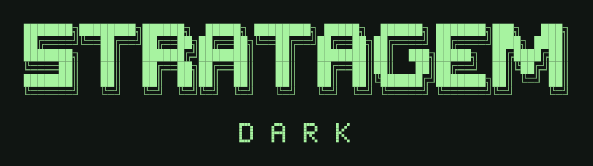

# STRATAGEM DARK



An independent, public open-source security workstation built on Arch Linux.
Keyboard-first, modular, and upstream-friendly. Original terminal/CRT-inspired
identity; curated tools for operators, defenders, and researchers.

**Status: testing-alpha build in progress.** The desktop is now derived from
Omarchy's MIT-licensed shell/configuration, rebranded as STRATAGEM DARK, with curated
Arch and BlackArch security tools. Required upstream attribution is preserved.

The release builder produces a signed offline package bundle and a branded UEFI
live ISO. A real VM test must pass before an artifact is called ready for testing.
See [testing release](docs/testing-release.md) for trust, installation and limitations.
The original dry-run/staging commands remain available; live bundle installation
uses the separate `dark install` command with an explicitly trusted signing fingerprint.

## Start here

Python 3.11+ and Bash are enough; no runtime Python dependencies. Run as your normal
user from a reviewed checkout:

```sh
git clone https://github.com/stratagem-group/stratagem-dark.git
cd stratagem-dark
./bin/dark --help
./bin/dark validate
./bin/dark profile list
./bin/dark plan --profile core
./bin/dark plan --profile full --json
./bootstrap/install.sh --profile operator --dry-run
# Parent must exist; destination must not exist:
mkdir -p build
./bootstrap/install.sh --profile core --stage build/core-root
python3 -m unittest discover -s tests -v
```

`--stage` writes a reviewable filesystem overlay plus a plan and file manifest.
It is a packaging prototype, not a chroot installer. Do not copy it over `/`.
See [bootstrap contract](docs/bootstrap.md) for prerequisites and the planned
clean-Arch installation sequence. Same inputs produce identical plan JSON and
staged file bytes; package versions and complete OS images are **not yet locked**.

## Profiles

| Profile | Composition | Purpose |
| --- | --- | --- |
| core | workstation baseline | Minimal security workbench and desktop |
| operator | core + network assessment | Authorized testing |
| defender | core + host/network inspection | Defensive analysis |
| research | core + binary analysis | Research in isolated labs |
| full | union of the above | Curated complete selection, not every upstream tool |

All catalog entries are candidates pending release review. Core works independently
of the optional BlackArch adapter. No AUR helper or unverified remote script runs.

## Layout

- `bin/`, `src/`: `dark` CLI and shared resolver/stager.
- `bootstrap/`: installer entry point and phase contracts.
- `profiles/`, `catalog/`, `schemas/`: explicit selections and validated metadata.
- `desktop/`, `config/`, `branding/`: original desktop defaults and visual tokens.
- `integrations/`, `locks/`, `packages/`: repository trust and future release packaging.
- `tests/`, `.github/`: automated checks and contribution workflow.
- `iso/`: deliberately disabled archiso placeholder.

[Architecture](docs/architecture.md) · [Roadmap](ROADMAP.md) ·
[Contributing](CONTRIBUTING.md) · [Security](SECURITY.md) ·
[License strategy](docs/licensing.md) · [Third-party notices](THIRD_PARTY_NOTICES.md) ·
[Upstream audit](docs/upstream-audit.md)

Original repository code, documentation, and artwork are MIT-licensed. Third-party
packages retain their own licenses; referring to a package is not a redistribution
or license clearance. The imported MIT desktop source and changes are recorded in `provenance/imports.json`.
No upstream branding artwork is used.
